# AxiomCart — From Concepts to Code

AxiomCart is a voice-enabled e-commerce assistant built as a LangGraph workflow. It combines **routing**, **specialist agents**, **tool calling**, **RAG**, **human-in-the-loop interruption**, **conversation memory**, and **response synthesis**.

This guide follows the code in the order a request travels through the application.

---

## Concept map

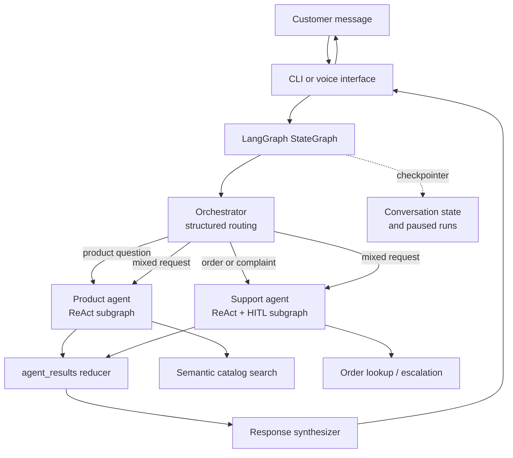

## Project map

| File | Responsibility |
| --- | --- |
| [src/main.py](src/main.py) | CLI, text/voice modes, graph invocation, interrupt resume loop |
| [src/config.py](src/config.py) | API key validation, OpenAI clients, shared logger |
| [src/data.py](src/data.py) | Demo catalog, orders, support policy, escalation queue |
| [src/rag.py](src/rag.py) | Product catalog → documents → Chroma vector store |
| [src/tools.py](src/tools.py) | Catalog search, order lookup, escalation actions |
| [src/state.py](src/state.py) | Main state, worker payload, structured routing schema, reducers |
| [src/nodes.py](src/nodes.py) | Prompts, subgraphs, routing, workers, synthesis |
| [src/graph.py](src/graph.py) | Parent graph wiring and `MemorySaver` compilation |
| [src/voice.py](src/voice.py) | Microphone → Whisper and TTS → speaker |

---

# 1. One request, one graph

Every interface sends the same input into `axiomcart_graph`. Text and voice are adapters around the same workflow, not separate business-logic implementations.

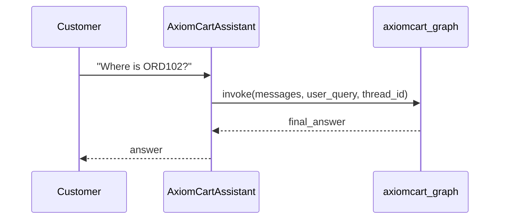

The entry point creates one `thread_id` for the session and invokes the compiled graph.

```python
# src/main.py
self.thread_id = uuid.uuid4().hex
config = {"configurable": {"thread_id": self.thread_id}}

result = axiomcart_graph.invoke(
    {"messages": [HumanMessage(content=text)], "user_query": text},
    config,
)
```

`thread_id` identifies a conversation. Reusing it preserves prior state; a new ID starts a clean conversation.

**Used in practice:** web applications typically use a thread ID per user and browser session. Ticketing systems can use a support-ticket ID.

---

# 2. Architecture: supervisor and specialists

AxiomCart uses a **supervisor pattern**:

- The **orchestrator** decides which specialist owns the request.
- The **product agent** handles product discovery and general conversation.
- The **support agent** handles orders, complaints, and escalation.
- The **synthesizer** turns multiple worker responses into one reply.

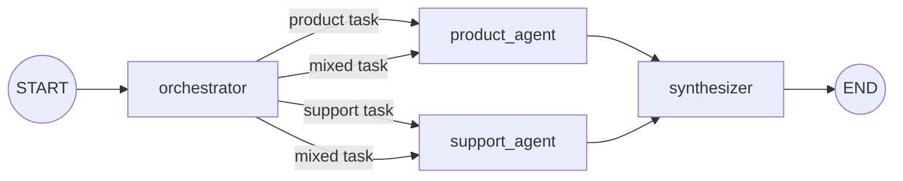

The parent graph intentionally contains only stable topology:

```python
# src/graph.py
builder = StateGraph(AxiomCartState)
builder.add_node("orchestrator", orchestrator_node)
builder.add_node("product_agent", product_agent)
builder.add_node("support_agent", support_agent)
builder.add_node("synthesizer", synthesizer_node)

builder.add_edge(START, "orchestrator")
builder.add_edge("synthesizer", END)
graph = builder.compile(checkpointer=MemorySaver())
```

The edges from the orchestrator are dynamic, so the node returns a `Command` rather than relying on fixed `add_edge()` calls.

**Used in practice:** this pattern fits retail, banking, SaaS, and healthcare assistants when responsibilities have different tools, policies, data sources, or permissions.

---

# 3. State and reducers: the contract between nodes

A LangGraph node reads the current state and returns only the fields it changes. Reducers define how those updates merge.

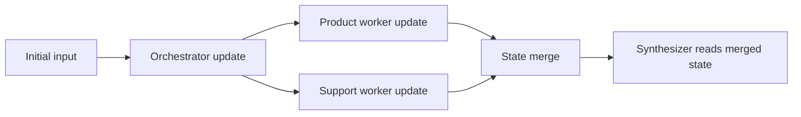

AxiomCart's state has three merge behaviours:

```python
# src/state.py
class AxiomCartState(TypedDict):
    messages: Annotated[list[AnyMessage], operator.add]
    user_query: str
    tasks: list[AgentTask]
    requires_synthesis: bool
    agent_results: Annotated[list[dict], agent_results_reducer]
    final_answer: str
```

| Field | Merge rule | Why |
| --- | --- | --- |
| `messages` | `operator.add` appends | Conversation history grows by turn. |
| `user_query`, `tasks`, `requires_synthesis`, `final_answer` | Replace | They describe the current request or output. |
| `agent_results` | Custom reducer | It resets per request, then collects worker output. |

The custom reducer prevents a later query from receiving stale worker results:

```python
# src/state.py
def agent_results_reducer(current: list[dict], update: list[dict]) -> list[dict]:
    if not update:
        return []                 # orchestrator starts a fresh request
    return current + update       # workers contribute results
```

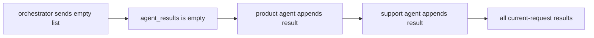

**Used in practice:** custom reducers are necessary when parallel branches write to a shared field: research aggregation, fraud checks, document review, or multi-source enrichment.

---

# 4. Structured routing and dynamic fan-out

The orchestrator asks the model for a constrained routing decision, rather than parsing free-form prose. `ClassificationResult` limits which agents can be chosen and includes a concrete task for each.

```python
# src/state.py
class AgentTask(BaseModel):
    agent: Literal["product_agent", "support_agent"]
    task_description: str

class ClassificationResult(BaseModel):
    tasks: List[AgentTask]
    requires_synthesis: bool
    reasoning: str
```

The model produces this structure; Python turns it into graph branches:

```python
# src/nodes.py
classifier = llm.with_structured_output(ClassificationResult)
classification = classifier.invoke(prompt)

targets = [
    Send(task.agent, {
        "messages": state.get("messages", []),
        "user_query": user_query,
        "task_description": task.task_description,
    })
    for task in classification.tasks
]

return Command(
    update={"tasks": classification.tasks,
            "requires_synthesis": classification.requires_synthesis,
            "agent_results": []},
    goto=targets,
)
```

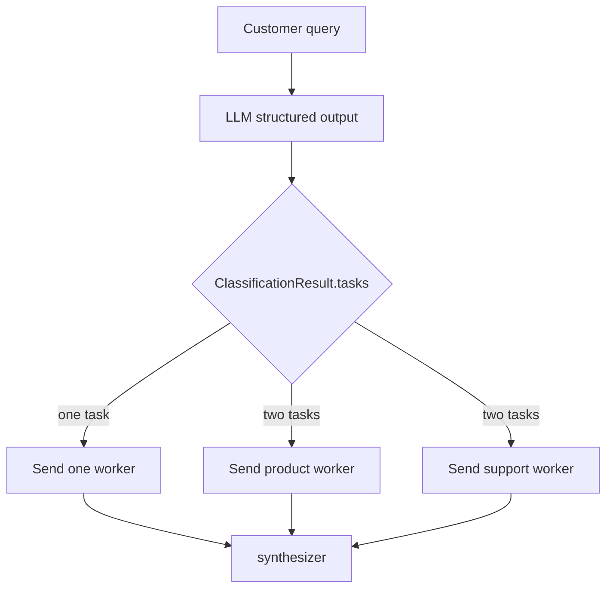

Each `Send(...)` gives the worker focused input rather than the entire parent state:

```python
# src/state.py
class WorkerInput(TypedDict):
    messages: Annotated[list[AnyMessage], operator.add]
    user_query: str
    task_description: str
```

**Used in practice:** structured routing is suited to bounded classifications such as billing / technical / account, sales / support, or retrieve / create / approve. It is observable and testable.

---

# 5. Tools and the ReAct loop

The model decides which action would help; Python executes the action. A tool is a typed function exposed through its name, docstring, and parameters.

```python
# src/tools.py
@tool
def get_order_status(identifier: str) -> str:
    """Look up the current status of a customer order.

    Args:
        identifier: an order ID (e.g. "ORD101") OR a customer email address
    """
    ...
```

The agents receive different tool sets:

```python
# src/nodes.py
product_tools = [search_product_catalog]
sales_tools = [get_order_status, escalate_to_human]

product_llm = llm.bind_tools(product_tools)
sales_llm = llm.bind_tools(sales_tools)
```

Each specialist contains a **ReAct loop**: model response → optional tool call → tool output → model response.

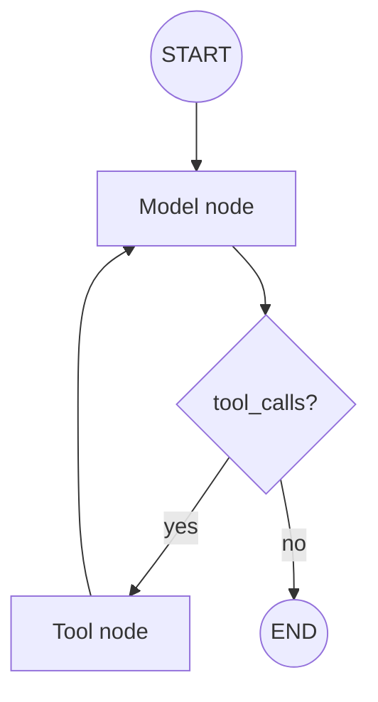

The condition checks for requested tools:

```python
# src/nodes.py
def should_continue(state: AgentState) -> str:
    last = state["messages"][-1]
    if hasattr(last, "tool_calls") and last.tool_calls:
        return "tools"
    return END
```

The tool node executes requests and returns `ToolMessage` results, which the model sees on its next turn:

```python
# src/nodes.py
def product_tools(state: AgentState) -> dict:
    results = []
    for tc in state["messages"][-1].tool_calls:
        out = product_tools_by_name[tc["name"]].invoke(tc["args"])
        results.append(ToolMessage(content=str(out), tool_call_id=tc["id"]))
    return {"messages": results}
```

**Used in practice:** tools connect models to databases, CRM systems, inventory, booking, payments, ticketing, search, and internal APIs. They are required wherever a model needs factual data or must cause a side effect.

---

# 6. RAG: product discovery from semantic retrieval

RAG is used for product discovery because users phrase needs naturally: “quiet headphones,” “budget earbuds,” or “a laptop for travel.” Exact-key lookup is too rigid for this kind of discovery.

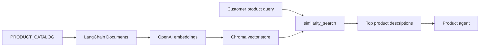

The catalog becomes searchable text plus metadata:

```python
# src/rag.py
docs.append(Document(
    page_content=(
        f"Product: {p['name']}\n"
        f"Brand: {p['brand']}\n"
        f"Category: {p['category']}\n"
        f"Price: ₹{p['price']}\n"
        f"Features: {', '.join(p['features'])}\n"
        f"Description: {p['description']}"
    ),
    metadata={"id": p["id"], "name": p["name"], "price": p["price"]},
))
```

The search tool retrieves three semantically close documents:

```python
# src/tools.py
@tool
def search_product_catalog(query: str) -> str:
    """Search the product catalog using semantic search (RAG)."""
    docs = product_vectorstore.similarity_search(query, k=3)
    ...
```

RAG returns relevant context, not a guaranteed database match. The product prompt therefore tells the agent not to pretend irrelevant products are matches.

**Used in practice:** semantic retrieval works for catalogs, knowledge bases, policies, manuals, support articles, and document libraries. Use exact database lookup when correctness depends on a primary key, live price, inventory count, balance, or authorization.

---

# 7. Memory and checkpoints

A checkpointer is a save system for graph state. AxiomCart uses `MemorySaver`, which persists state while its Python process remains alive.

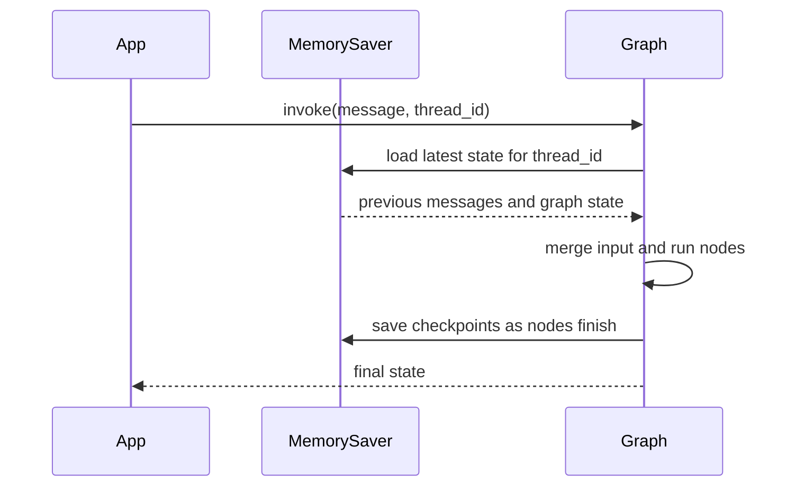

```python
# src/graph.py
memory = MemorySaver()
graph = builder.compile(checkpointer=memory)
```

```python
# src/main.py
config = {"configurable": {"thread_id": self.thread_id}}
```

Two ideas work together:

- `messages` retains the conversation by appending message objects.
- The checkpointer retains the full state and graph execution position for the thread.

**Used in practice:** checkpoints let a conversation continue across web requests, make pauses resumable, and support debugging via state history. `MemorySaver` is for demos and tests; production needs a durable shared checkpointer such as PostgreSQL.

---

# 8. Human-in-the-loop: pause, ask, resume

The support agent must not guess an order ID. When it has not called a tool and returns no tool calls, AxiomCart treats its response as a request for missing information and pauses the graph.

```mermaid
sequenceDiagram
    participant User
    participant Support as support_model
    participant CP as Checkpointer
    participant App as query()

    User->>Support: "Where is my order?"
    Support->>Support: No identifier; model asks for one
    Support->>CP: interrupt(question), save paused state
    CP-->>App: __interrupt__ contains question
    App-->>User: "Please provide your order ID"
    User-->>App: "ORD102"
    App->>CP: Command(resume="ORD102")
    CP->>Support: Resume at interrupt()
    Support->>Support: Call get_order_status
    Support-->>User: Status response
```

The pause happens inside the support model node:

```python
# src/nodes.py
if not response.tool_calls:
    any_tools_called = any(isinstance(m, ToolMessage) for m in state["messages"])
    if not any_tools_called:
        user_reply = interrupt(response.content)
        return {"messages": [response, HumanMessage(content=str(user_reply))]}
```

The interface handles input and resumes the same run:

```python
# src/main.py
while "__interrupt__" in result and result["__interrupt__"]:
    question = result["__interrupt__"][0].value
    user_answer = input_fn(question)
    result = axiomcart_graph.invoke(Command(resume=user_answer), config)
```

`interrupt()` depends on the checkpointer. Without a saved checkpoint, there is no suspended graph to resume.

**Used in practice:** use this pattern to collect missing data, approve refunds, review high-risk content, confirm purchases, or route a decision to an operations team.

---

# 9. Fan-in and response synthesis

Each worker writes a result tagged by source. The custom reducer gathers results, then the synthesizer either passes through one answer or combines several answers.

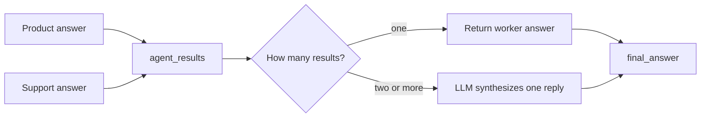

Workers return the same small shape:

```python
# src/nodes.py
return Command(
    update={"agent_results": [{"source": "product_discovery", "response": answer}]},
    goto="synthesizer",
)
```

The synthesizer skips an extra LLM call for a one-worker request:

```python
# src/nodes.py
if len(results) == 1:
    return {"final_answer": results[0]["response"]}

parts = "\n\n".join(
    f"[{r['source'].upper()}]:\n{r['response']}" for r in results
)
merged = llm.invoke(prompt)
return {"final_answer": merged.content}
```

**Used in practice:** synthesis is useful for compound customer questions, research workflows, and operations assistants that combine several independent findings. It should compose language, not authorize actions or create factual records.

---

# 10. Voice is an interface layer

Voice does not change routing or agent behavior. It converts audio to the same text input and converts the final text answer back to audio.


```python
# src/voice.py
result = openai_client.audio.transcriptions.create(
    model="whisper-1", file=buf, language=language,
)

resp = openai_client.audio.speech.create(
    model="tts-1", voice=self.voice, input=text, speed=self.speed,
)
```

```python
# src/main.py
_, transcript = self.recorder.record_and_transcribe(duration=5)
answer = self.query(transcript)
self.speaker.speak(answer)
```

**Used in practice:** the graph can power phone support, a mobile voice assistant, an accessibility interface, or a kiosk. Transcription confidence, latency, consent, and a text fallback are operational concerns.

---

# 11. Application boundaries and production gaps

The repository is an educational, in-memory implementation. Its architecture is useful, but several components need to change for a customer-facing deployment.

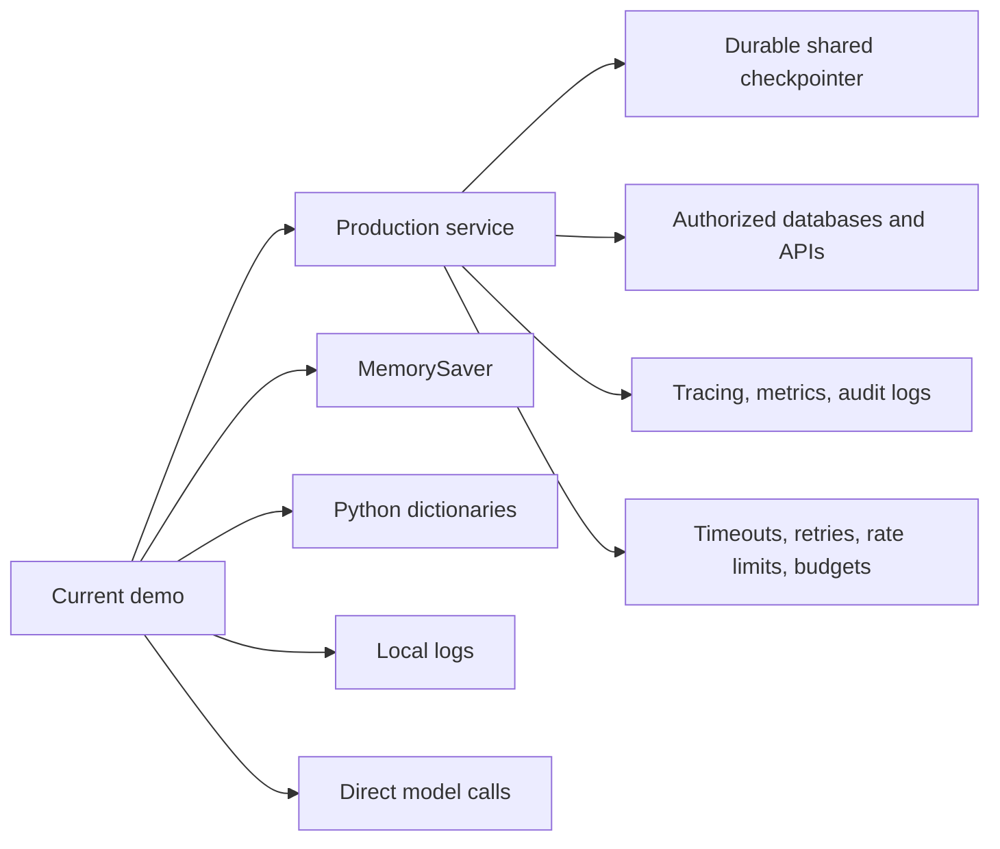

| Current component | Current purpose | Production direction |
| --- | --- | --- |
| `MemorySaver` | Keeps local process state | PostgreSQL or another shared durable checkpointer |
| `PRODUCT_CATALOG` and `ORDER_DATABASE` | Readable demo data | Product, inventory, OMS, and CRM APIs with authorization |
| `ESCALATION_QUEUE` | In-memory ticket example | Ticketing workflow with idempotency, audit records, notifications |
| Prompt-only behavior | Guides normal model behaviour | Prompt + deterministic policy checks + input/output validation |
| Module-level RAG store | Builds a tiny index at import | Persistent vector store, re-indexing, metadata filters |
| Direct OpenAI calls | Demonstrates model/tool flow | Timeouts, retries, token limits, tracing, cost controls, fallback |

Two repository details matter before cost-controlled use:

1. [.env.example](.env.example) documents `LLM_MODEL`, but [src/config.py](src/config.py) currently hard-codes `gpt-4o`; changing the environment variable alone does not change the chat model.
2. `escalate_to_human()` creates an in-memory ticket; email notification is not active in [src/tools.py](src/tools.py).

---

# End-to-end trace

For **“My order is delayed. Also, recommend alternatives to the headphones I ordered.”**, followed by `ORD102`:

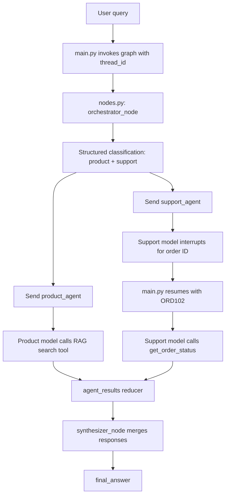

AxiomCart is not one chatbot with a large prompt. It is a stateful graph with clear boundaries:

```text
interface → state → routing → specialist loop → tools/RAG → checkpoint/HITL → result merge → final response
```
