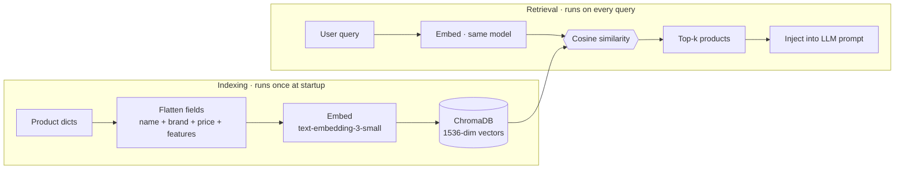
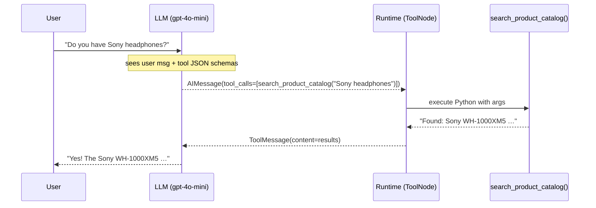
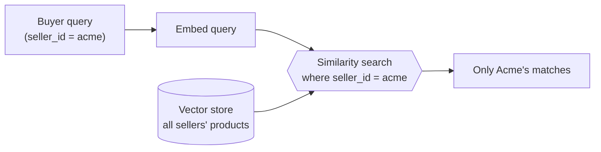
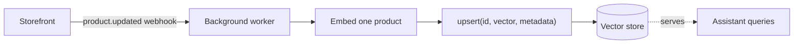

# Module 1 — The Toolkit

> **Goal:** Build the foundation every agent depends on — LLM clients, static data, a semantic search index, and three callable tools.
> **Duration:** ~30 minutes
> **You will end this module with:** Three standalone tools that work without any graph, agent, or orchestrator.

---

## Environment Setup with uv

`uv` is a Rust-based Python package manager that replaces pip + virtualenv in a single tool. It resolves dependencies an order of magnitude faster and produces fully reproducible environments.

**macOS / Linux**

```bash
# 1. Install uv (one-time)
curl -LsSf https://astral.sh/uv/install.sh | sh

# 2. Create a virtual environment pinned to Python 3.11
uv venv .venv --python 3.11

# 3. Activate it
source .venv/bin/activate

# 4. Install all project dependencies from pyproject.toml
uv sync

# 5. Copy secrets template and add your key
cp .env.example .env
# Open .env and set OPENAI_API_KEY=sk-...
```

**Windows (PowerShell)**

```powershell
# 1. Install uv (one-time)
powershell -ExecutionPolicy ByPass -c "irm https://astral.sh/uv/install.ps1 | iex"
#    Alternatives: winget install --id=astral-sh.uv -e   |   scoop install uv   |   pip install uv
#    Close and reopen the terminal afterwards so `uv` is on your PATH.

# 2. Create a virtual environment pinned to Python 3.11
uv venv .venv --python 3.11

# 3. Activate it (PowerShell)
.venv\Scripts\Activate.ps1
#    cmd.exe instead:  .venv\Scripts\activate.bat
#    If activation is blocked, run once:
#    Set-ExecutionPolicy -ExecutionPolicy RemoteSigned -Scope CurrentUser

# 4. Install all project dependencies from pyproject.toml
uv sync

# 5. Copy secrets template and add your key
copy .env.example .env
# Open .env and set OPENAI_API_KEY=sk-...
```

`uv sync` reads `pyproject.toml` and installs the exact locked versions. Every teammate who runs `uv sync` gets an identical environment — no "works on my machine" issues.

Further reading: [uv documentation](https://docs.astral.sh/uv/)

---

## What You'll Build

```
modules/stage1/
├── config.py   ← OpenAI clients + logger (imported by all other modules)
├── data.py     ← product catalog, order DB, support policies
├── rag.py      ← ChromaDB vector store built from the catalog at import time
└── tools.py    ← 3 tools: semantic search, order lookup, escalation
```

By the end of this module, all three tools are runnable independently — no graph, no agent, no orchestrator needed yet.

---

## Concept 1: Config, Secrets, and the Twelve-Factor Principle

### Why `.env` files?

Hard-coding API keys is the fastest way to get your account compromised. The [Twelve-Factor App](https://12factor.net/config) principle says configuration that varies between deployments (dev/staging/prod) must be stored in the environment, not in code.

```python
import os
from openai import OpenAI

# ❌ Never do this — gets committed, gets leaked
client = OpenAI(api_key="sk-abc123...")

# ✅ config.py — load from environment
from dotenv import load_dotenv
load_dotenv()                   # reads .env → injects into os.environ
OPENAI_API_KEY = os.environ.get("OPENAI_API_KEY", "")
```

`python-dotenv` reads a `.env` file and injects its key=value pairs into `os.environ` before any module reads them. The `.env` file is excluded from git via `.gitignore`. In production (GCP Cloud Run, AWS Lambda, Heroku) you set these same environment variables via the platform's secrets manager — your code doesn't change.

### Fail-fast validation

`config.py` validates the key at import time:

```python
import sys

if not OPENAI_API_KEY or OPENAI_API_KEY.startswith("sk-your"):
    logger.error("OPENAI_API_KEY is missing or placeholder")
    sys.exit(1)
```

This crashes loudly at startup rather than silently producing wrong output 10 layers deep inside a tool call. In production systems this pattern is called a "pre-flight check".

### The three clients

| Name | Class | Purpose |
|---|---|---|
| `llm` | `ChatOpenAI(model="gpt-4o-mini", temperature=0.3)` | All LLM reasoning — used by every agent |
| `embeddings` | `OpenAIEmbeddings(model="text-embedding-3-small")` | Text → vector (RAG indexing + retrieval) |
| `openai_client` | `openai.OpenAI()` | Raw SDK — used for TTS and Whisper STT in Module 4 |

`temperature=0.3` balances creativity with consistency. At `0.0` the model is fully deterministic; at `1.0` outputs vary widely. For a shopping assistant we want slightly creative language but reliable tool calls, so `0.3` is the sweet spot.

References: [python-dotenv](https://pypi.org/project/python-dotenv/) · [langchain-openai ChatOpenAI](https://python.langchain.com/docs/integrations/chat/openai/) · [12-factor config](https://12factor.net/config)

---

## Concept 2: RAG — Retrieval-Augmented Generation

### The core problem

An LLM knows about the world as of its training cut-off. It knows nothing about your product catalog, your current prices, or your stock availability. You have two options:

1. Paste the entire catalog into every prompt — wastes tokens, hits context limits, expensive
2. Retrieve only the relevant products and inject them into the prompt — this is RAG

### The two-phase architecture

**Phase 1 — Indexing (runs once at startup)**

```
Each product dict
    → flatten all fields into one string (name + brand + price + features + description)
    → OpenAI text-embedding-3-small                   # 1536-dimensional vector
    → stored in ChromaDB with metadata (name, price, category)
```

**Phase 2 — Retrieval (runs at query time)**

```
User query: "noise cancelling headphones under 15k"
    → embed the query (same model, same 1536 dimensions)
    → cosine similarity search against all stored vectors
    → return top-k products whose vectors are most similar
    → inject the product text into the LLM prompt
```

The same two-phase flow, drawn as a pipeline:



The key insight: **the query and the documents are embedded by the same model into the same vector space**, so semantic closeness becomes geometric closeness.

### Why cosine similarity?

Cosine similarity measures the angle between two vectors, not their magnitude. Two vectors pointing in the same direction (same semantic meaning) have $\cos(\theta) \approx 1.0$ regardless of their length.

$$\cos(\theta) = \frac{\vec{A} \cdot \vec{B}}{|\vec{A}||\vec{B}|}$$

A query for "noise cancelling headphones under 15k" will embed close to a product description containing "Active Noise Cancellation" + "₹10199" even if none of those exact words appear in the query — because the model learned that these concepts co-occur.

### Why flatten all fields?

```python
# p is a single product dict from PRODUCT_CATALOG (src/data.py)
content = (
    f"Product: {p['name']}\n"
    f"Brand: {p['brand']}\n"
    f"Price: ₹{p['price']}\n"
    f"Features: {', '.join(p['features'])}\n"
    f"Description: {p['description']}\n"
)
```

A richer document → more semantically informative embedding. Price (`₹10199`) embedded alongside features (`"ANC"`, `"30-hour battery"`) means both price constraints and feature queries match the same document.

### When to persist vs rebuild

This module rebuilds the vector store from scratch on every Python process start (in-memory ChromaDB). This is fine for a course with a small catalog. In production:

- Use `chromadb.PersistentClient(path="./chroma_db")` to write the index to disk once
- Only re-index when the catalog changes
- For larger catalogs (millions of products) use a managed vector DB: Pinecone, Weaviate, Qdrant, or pgvector

References: [OpenAI Embeddings guide](https://platform.openai.com/docs/guides/embeddings) · [ChromaDB docs](https://docs.trychroma.com/) · [LangChain Chroma integration](https://python.langchain.com/docs/integrations/vectorstores/chroma/)

---

## Concept 3: The `@tool` Decorator and the Tool-Calling Protocol

### What `@tool` actually does

The `@tool` decorator wraps a Python function and generates a JSON schema from its name, docstring, and type hints:

```python
from langchain.tools import tool

@tool
def search_product_catalog(query: str) -> str:
    """Search the AxiomCart product catalog using semantic search.

    Args:
        query: natural-language search, e.g. "wireless headphones under 5000"
    """
    ...
```

LangChain automatically produces:

```json
{
  "name": "search_product_catalog",
  "description": "Search the AxiomCart product catalog using semantic search.",
  "parameters": {
    "type": "object",
    "properties": {
      "query": {
        "type": "string",
        "description": "natural-language search, e.g. \"wireless headphones under 5000\""
      }
    },
    "required": ["query"]
  }
}
```

This schema is sent to the LLM via OpenAI's `tools` parameter. The LLM uses it to decide whether to call the function and what arguments to pass.

### The LLM never executes Python

```
User: "Do you have Sony headphones?"
        ↓
LLM receives: [user message] + [tool schemas]
        ↓
LLM outputs: AIMessage with tool_calls = [{"name": "search_product_catalog", "args": {"query": "Sony headphones"}}]
        ↓
Your runtime (LangGraph ToolNode) calls the actual Python function
        ↓
search_product_catalog("Sony headphones") → product results string
        ↓
ToolMessage(content=results) appended to state
        ↓
LLM sees the result and generates a natural-language answer
```

The LLM never executes code. It only outputs a JSON blob saying which function to call with which arguments. Your application code does the actual execution. This separation is what makes the system safe — the LLM cannot call arbitrary code or access anything you haven't explicitly exposed as a tool.

### Docstrings matter — they are the LLM's API documentation

Write docstrings as if a junior developer (who cannot read your source code) needs to understand when and how to use the function. The LLM reads the description verbatim when deciding whether to invoke the tool. A vague docstring produces inconsistent tool selection.

```python
from langchain.tools import tool

# ❌ Vague — LLM won't know when to call this
@tool
def lookup(identifier: str) -> str:
    """Look up something."""

# ✅ Specific — LLM knows exactly when and how
@tool
def get_order_status(identifier: str) -> str:
    """Look up the current status of an AxiomCart order.

    Args:
        identifier: an order ID like 'ORD101' OR a customer email address.
                    The order ID formats 'ORD-101', 'ord101', and '101' are all accepted.
    """
```

### Tool inventory in this module

| Tool | Input | What it does |
|---|---|---|
| `search_product_catalog` | `query: str` | Embeds the query, cosine-similarity search, returns top-3 product descriptions |
| `get_order_status` | `identifier: str` | Accepts order ID or email, normalises ID format, returns order details |
| `escalate_to_human` | `order_id, issue_summary, priority` | Appends a ticket to `ESCALATION_QUEUE`; in production this writes to a DB and triggers an email |

References: [LangChain @tool decorator](https://python.langchain.com/docs/concepts/tools/) · [OpenAI tool calling](https://platform.openai.com/docs/guides/function-calling)

---

## End-to-End Testing

Run the interactive test script from the **project root** (not from inside `modules/`):

```bash
uv run python modules/stage1/test_stage1.py
```

The script demonstrates all three concepts with labelled output sections: LLM connection, RAG semantic search, and all three tools invoked directly.

To run with pytest once you add assertion-based tests:

```bash
uv run pytest modules/stage1/ -v
```

Never use `python -c "..."` one-liners in a shared codebase. They are non-reproducible, cannot be tracked in CI, and obscure errors. Use scripts or pytest test functions so results are visible in your CI pipeline.

---

## Design Tradeoffs

Every choice in this module trades one property for another. These are the decisions you will have to defend in a real system — there is no universally "correct" answer, only the right answer *for your constraints*.

| Decision | We chose | Alternative | The trade-off |
|---|---|---|---|
| **Vector store** | ChromaDB (in-process) | Pinecone / Weaviate / Qdrant / pgvector | Zero infra & instant setup **vs.** durability, horizontal scale, and hybrid (BM25 + vector) search. The LangChain `VectorStore` interface is uniform, so swapping is ~a one-line change in `rag.py`. |
| **Index lifecycle** | Rebuild on every startup | Persist once, connect on boot | Simplicity **vs.** cost & cold-start latency. Re-embedding on every boot pays the embedding bill and the indexing wait *every* time the process restarts. |
| **Tool granularity** | One `get_order_status` for ID *and* email | One tool per identifier type | Fewer tools = clearer routing **vs.** narrower, more explicit schemas. Real users type "my last order", an email, or `ord-101`; one normalising tool absorbs that variance. |
| **Tools per agent** | 3 focused tools | One mega-agent with every tool | Reliable selection **vs.** a single entry point. OpenAI accepts up to 128 tools per request, but selection accuracy degrades past ~20. Module 2 splits tools across specialists for exactly this reason. |
| **Tool error handling** | `ToolNode` returns an error `ToolMessage` | Raise and crash the graph | Self-healing (the LLM can retry or explain) **vs.** fail-fast. Toggle it with `ToolNode(tools, handle_tool_errors=...)`. |

What the LLM actually does with a tool — note that **your code executes the function, not the model**:



---

## From Catalog to Production: The Same Three Concepts, Reused

The **config → RAG → `@tool`** triad you just built is the backbone of almost every retrieval assistant. The domain changes; the architecture does not. Here is how the *identical* pattern powers three very different real systems.

### Example 1 — Internal HR / IT policy assistant

Swap the product catalog for your company's policy PDFs and the structure is unchanged.

| Stage 1 concept | HR assistant equivalent |
|---|---|
| `PRODUCT_CATALOG` dicts | Chunked policy documents (leave, expenses, security) |
| `search_product_catalog` | `search_policies(query)` — same embedding + cosine search |
| `get_order_status` | `get_ticket_status(ticket_id)` against the ITSM system |
| `escalate_to_human` | `open_helpdesk_ticket(summary, priority)` |

The only real change is the **documents you embed** and the **system of record your tools call**. RAG keeps answers grounded in *current* policy instead of the model's stale training data.

### Example 2 — Multi-tenant marketplace search

When one platform hosts many sellers, you cannot let buyers see across tenants. Add a `seller_id` to each document's metadata and filter at query time — the embedding logic is untouched.



```python
from src.rag import product_vectorstore as vector_store

# Metadata filtering — same vector store, scoped results
vector_store.similarity_search(
    query, k=3, filter={"seller_id": current_seller}
)
```

This single `filter` line is how you turn a shared index into a safe multi-tenant one.

### Example 3 — Live catalog with incremental upserts

Production catalogs change hourly. Instead of rebuilding the whole index, a webhook from your storefront (Shopify, WooCommerce) triggers a worker that embeds **only** the changed product and upserts it.



ChromaDB, Pinecone, Weaviate, and Qdrant all support `upsert`, so a stale product never lingers in search results and you never pay to re-embed the whole catalog.

### Carry-over hardening (applies to all three)

- **Persist the index** — connect to an existing store on boot instead of re-embedding.
- **Wrap `llm.invoke()` with `tenacity`** for exponential backoff against per-minute rate limits.
- **Truncate tool output** — cap `search_product_catalog` results so a huge catalog can't overflow the context window.

---

## Production and Next Steps

This module establishes the data + tooling layer. Before moving this to production:

1. **Persist the vector store** — use `chromadb.PersistentClient` or a managed service, and store the client URL in `.env`
2. **Add secrets management** — replace `.env` with AWS Secrets Manager, GCP Secret Manager, or HashiCorp Vault in production. Never use `.env` files in containers
3. **Observability** — swap `logging.StreamHandler` for a structured JSON logger (e.g. `structlog`) that ships to Datadog, GCP Logging, or Grafana Loki
4. **Limit tool output size** — `search_product_catalog` returns raw product text. Add a `max_chars` truncation to prevent context overflow with large catalogs

Next step: [Module 2](../stage2/README.md) — wire these tools into a LangGraph agent loop.
