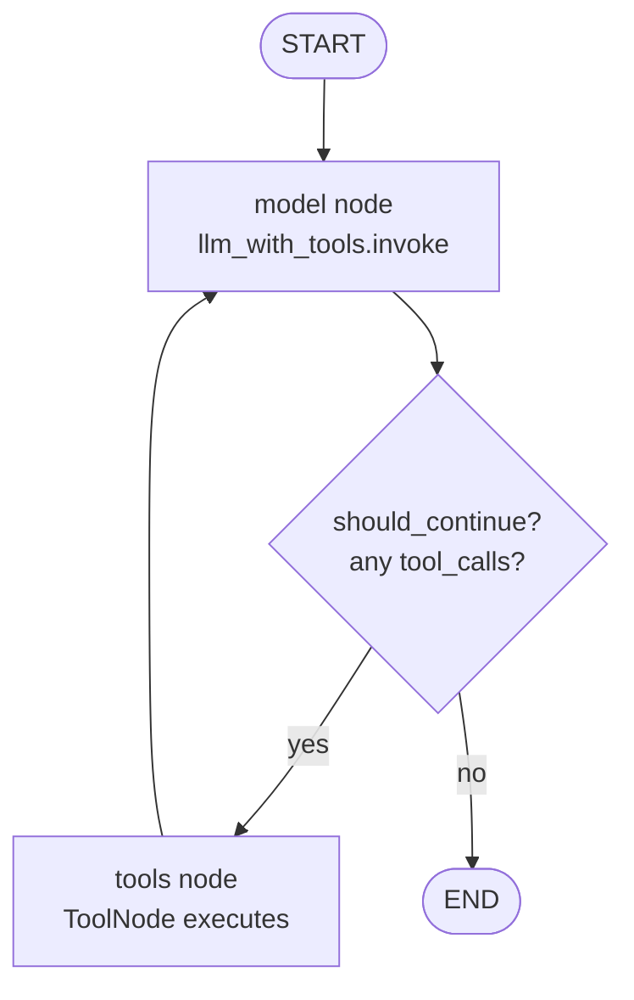
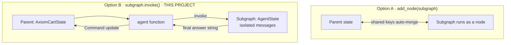
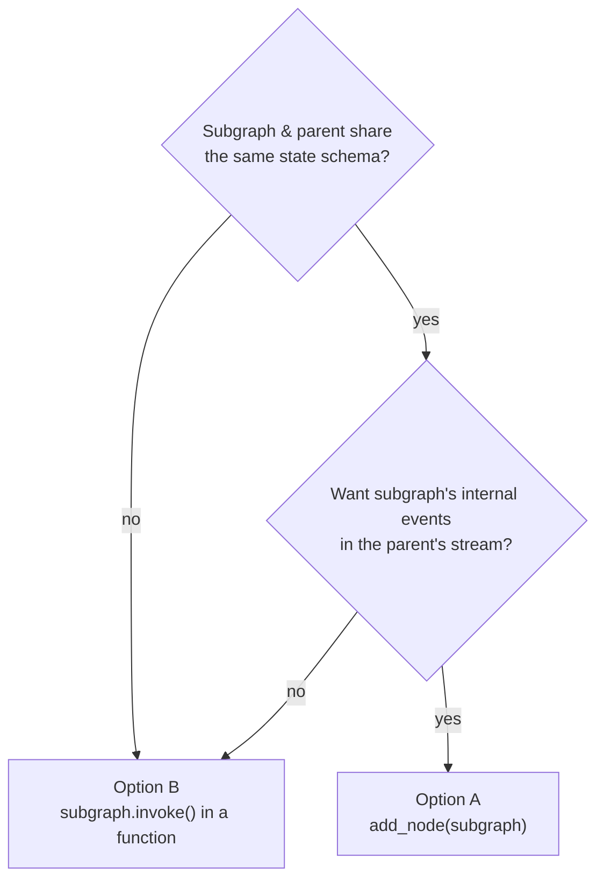
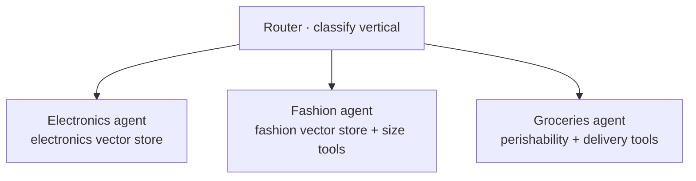

# Module 2 — The Agent Loop

> **Goal:** Build two specialist agents — each an LLM inside a ReAct loop compiled as a LangGraph subgraph.
> **Duration:** ~35 minutes
> **Builds on:** Module 1 (config, data, rag, tools)
> **You will end with:** Two standalone agents you can invoke directly, before any orchestrator exists.

---

## What You'll Build

```
modules/stage2/
├── state.py   ← AgentState TypedDict — the shared message log
└── nodes.py   ← product_subgraph + support_subgraph (two compiled agents)
```

---

## Concept 1: LangGraph State

### What state is

State is the data structure that flows through every node in the graph. Every node reads the current state and returns a dict of updates. LangGraph merges those updates back into the state using **reducers** before passing them to the next node.

```python
from typing import Annotated, TypedDict
import operator
from langchain.messages import AnyMessage

class AgentState(TypedDict):
    messages: Annotated[list[AnyMessage], operator.add]
```

The `Annotated[T, reducer]` syntax attaches a reducer function to a field. The reducer tells LangGraph how to merge an update into the current value.

### Reducers: how updates are merged

Without a reducer, a node's return value **replaces** the field entirely:

```python
# No reducer — last write wins (dangerous for messages)
class State(TypedDict):
    messages: list[AnyMessage]
    # a node returning {"messages": [new_msg]} WIPES all previous messages
```

With `operator.add` as the reducer, LangGraph **appends**:

```python
# Node returns:   {"messages": [AIMessage("I'll search for that")]}
# Current state:  {"messages": [SystemMessage, HumanMessage]}
# After reducer:  {"messages": [SystemMessage, HumanMessage, AIMessage]}
#                                                              ^ appended
```

This is critical for agents: the full conversation history must accumulate across every model call and tool call. If messages were replaced instead of appended, the LLM would lose all context on the second call.

### Writing a custom reducer

`operator.add` works for lists. For other merge strategies you pass any callable `(current_value, update) -> new_value`:

```python
import operator
from typing import Annotated, TypedDict
from langchain.messages import AnyMessage

def keep_last(current, update):
    return update   # always overwrite with the newest value

class AxiomCartState(TypedDict):
    messages: Annotated[list[AnyMessage], operator.add]   # accumulate
    final_answer: Annotated[str, keep_last]               # replace
    agent_results: Annotated[list[dict], operator.add]    # accumulate
```

In Module 3, `agent_results` uses `operator.add` so both the product agent and support agent can write their answers concurrently without one overwriting the other.

### Message types in LangChain

| Type | Sender | When it appears |
|---|---|---|
| `SystemMessage` | You | The agent's persona and rules — injected at the start of every call |
| `HumanMessage` | User | The customer's question (or a HITL answer in Module 4) |
| `AIMessage` | LLM | Model response. If `tool_calls` is non-empty, the LLM wants to call tools |
| `ToolMessage` | Tool execution | The result of running a tool, linked by `tool_call_id` |

The LLM sees the full `messages` list on every call — it is the LLM's working memory within one agent run.

References: [LangGraph state concepts](https://langchain-ai.github.io/langgraph/concepts/low_level/#state) · [Reducers](https://langchain-ai.github.io/langgraph/concepts/low_level/#reducers)

---

## Concept 2: The ReAct Loop and What `compile()` Does

### What ReAct is

ReAct (Reason + Act) is the pattern where an LLM alternates between **reasoning** (model call, potentially producing tool calls) and **acting** (executing tools) until it has a complete answer with no pending tool calls.

LangGraph implements this as a two-node graph with a conditional edge:

```
START
  |
model node --> [should_continue()?]
                    |             |
                 "tools"         END
                    |
              tools node
                    |
              (loop back to model)
```

The same loop as a state graph:



The cycle **model → tools → model** repeats until the LLM returns a message with no `tool_calls` — that is the agent deciding it is "done". A greeting exits on the first pass (no tools); a product question loops at least once.

```python
from langgraph.graph import END, START, StateGraph
from langgraph.prebuilt import ToolNode

from src.config import llm
from src.tools import search_product_catalog
from modules.stage2.state import AgentState

llm_with_tools = llm.bind_tools([search_product_catalog])

def model_node(state: AgentState) -> dict:
    response = llm_with_tools.invoke(state["messages"])
    return {"messages": [response]}

def should_continue(state: AgentState) -> str:
    last = state["messages"][-1]
    if getattr(last, "tool_calls", None):
        return "tools"
    return END

builder = StateGraph(AgentState)
builder.add_node("model", model_node)
builder.add_node("tools", ToolNode([search_product_catalog]))
builder.add_edge(START, "model")
builder.add_conditional_edges("model", should_continue)
builder.add_edge("tools", "model")
agent = builder.compile()
```

### What `compile()` actually does

`compile()` seals the graph into a **Pregel runner** — a parallel message-passing execution engine. After compilation:

- The graph topology (nodes and edges) is validated — missing nodes and type mismatches are caught
- The graph becomes an executable object with `.invoke()`, `.stream()`, `.ainvoke()`, `.astream()` methods
- An optional checkpointer is attached (Module 4)
- The graph is immutable — you cannot add nodes or edges after `compile()`

The Pregel runner executes one "superstep" at a time. Each superstep runs all nodes that have pending input messages. This is what enables parallel fan-out in Module 3.

### `bind_tools()` — teaching the LLM about available actions

```python
from src.config import llm
from src.tools import search_product_catalog, get_order_status, escalate_to_human

product_llm = llm.bind_tools([search_product_catalog])
support_llm = llm.bind_tools([get_order_status, escalate_to_human])
```

`bind_tools()` adds the tools' JSON schemas to every API call made via that LLM instance. The LLM responds with either plain text (done) or a list of `tool_calls` (wants to act). The conditional edge reads this choice and routes accordingly.

### `ToolNode` — the built-in tool executor

`ToolNode` is a prebuilt LangGraph node that executes all tool calls from the last `AIMessage`, runs them (potentially in parallel if the LLM requested multiple), and returns a list of `ToolMessage` objects. If a tool raises an exception, it returns an error `ToolMessage` so the LLM can recover gracefully rather than crashing the graph.

References: [ReAct implementation](https://langchain-ai.github.io/langgraph/concepts/agentic_concepts/#react-implementation) · [ToolNode](https://langchain-ai.github.io/langgraph/reference/prebuilt/#langgraph.prebuilt.tool_node.ToolNode) · [bind_tools](https://python.langchain.com/docs/concepts/tool_calling/)

---

## Concept 3: Subgraphs — Two Ways to Compose Graphs

This is one of the most consequential architectural decisions in LangGraph. There are two distinct patterns:

### Option A — Subgraph registered as a node with `add_node(subgraph)`

```python
parent = StateGraph(ParentState)
parent.add_node("product_agent", product_subgraph)  # compiled graph as node
```

LangGraph calls `product_subgraph.invoke(sub_state)` where `sub_state` is derived from the parent state. The subgraph runs to completion and its output is merged back into the parent state using the parent's reducers.

**State sharing requirement:** The subgraph's TypedDict must share at least one key with the parent's TypedDict — or you must provide explicit `input`/`output` transformation callables. If both states have a `messages` key with compatible types, updates flow automatically. Mismatched schemas raise a validation error at compile time.

**Streaming advantage:** Events emitted inside the subgraph (node entries, exits, LLM tokens) are visible to the parent via `graph.stream(..., subgraphs=True)`. You get full observability into the subgraph's execution from outside.

**Use this when:**
- The subgraph's state keys overlap with the parent's state keys (shared `messages`, etc.)
- You want streaming events from inside the subgraph to surface at the parent level
- The subgraph is a named node in the graph topology with edges pointing to/from it
- You are building a hierarchical multi-agent system where the parent graph orchestrates named sub-agents as nodes

### Option B — Subgraph invoked inside a regular Python function

```python
from typing import Literal
from langchain.messages import HumanMessage, SystemMessage
from langgraph.types import Command

# Subgraph compiled separately, called inside a plain function
product_subgraph = subgraph_builder.compile()

def product_agent_node(state: WorkerInput) -> Command[Literal["synthesizer"]]:
    result = product_subgraph.invoke({
        "messages": [SystemMessage(content=PRODUCT_PROMPT),
                     HumanMessage(content=state["user_query"])]
    })
    answer = result["messages"][-1].content
    return Command(
        update={"agent_results": [{"source": "product", "response": answer}]},
        goto="synthesizer",
    )

parent = StateGraph(ParentState)
parent.add_node("product_agent", product_agent_node)  # plain function, not subgraph
```

The parent graph has no awareness of the subgraph. It only sees a Python function that returns a dict update.

**Use this when:**
- The subgraph has a completely different state schema from the parent — as in this project (`AgentState` vs `AxiomCartState`)
- You want full manual control over what inputs flow into the subgraph and what outputs flow back out
- The subgraph's internal execution should be invisible to parent-level streaming
- You want to test the subgraph in complete isolation with `subgraph.invoke()`
- You are building a functional, imperative style rather than a declarative graph topology

### Which pattern does this project use and why?

This project uses **Option B**:

```
product_subgraph  (compiled with AgentState schema)
support_subgraph  (compiled with AgentState schema)
    |
called via .invoke() inside product_agent_node() and support_agent_node()
    |
parent graph (AxiomCartState) sees only the Command return value
```

The two composition styles, side by side:



Reason: `AgentState` and `AxiomCartState` have different schemas. The subgraph's internal `messages` (system prompt, tool calls, tool results) are implementation details the parent doesn't need to see. The parent only cares about the final answer string extracted from `result["messages"][-1].content`. Option B makes this boundary explicit and keeps the parent state clean.

### When state sharing between subgraph and parent is risky

If you use Option A and both parent and subgraph have `messages: Annotated[list, operator.add]`, then every `ToolMessage` and intermediate `AIMessage` from inside the subgraph accumulates in the parent's `messages` list. For a simple graph this is fine. For a parallel multi-agent system where two subgraphs run concurrently and both write to `messages`, you can get interleaved message sequences that confuse the downstream synthesizer. Option B avoids this by giving each subgraph an isolated message list.

References: [Subgraphs concepts](https://langchain-ai.github.io/langgraph/concepts/subgraphs/) · [How-to: subgraphs](https://langchain-ai.github.io/langgraph/how-tos/subgraph/) · [Multi-agent architectures](https://langchain-ai.github.io/langgraph/concepts/multi_agent/)

---

## Concept 4: Agent Specialisation via System Prompts

Both subgraphs use the same graph skeleton. What makes them different is the system prompt and the bound tools. The system prompt is the agent's job description — it defines persona, rules, and edge-case handling.

```
product_subgraph:                   support_subgraph:
  llm.bind_tools([                    llm.bind_tools([
    search_product_catalog              get_order_status,
  ])                                    escalate_to_human
  system = PRODUCT_PROMPT             ])
                                      system = SUPPORT_PROMPT
```

**Why not one agent with all tools?**

As the number of tools grows, the LLM must choose the right one from a larger set. Performance and reliability degrade. With specialist agents, each agent has a focused tool set and a focused system prompt — routing is unambiguous and each specialist can be independently tuned and tested.

---

## End-to-End Testing

Run the interactive demonstration from the **project root**:

```bash
uv run python modules/stage2/test_stage2.py
```

This shows:
- The full message sequence for a product query (tool IS called)
- The full message sequence for a greeting (tool is NOT called — LLM responds directly)
- Both specialist agents handling their respective domains

To run with pytest once you have assertion-based tests:

```bash
uv run pytest modules/stage2/ -v
```

---

## Design Tradeoffs

| Decision | We chose | Alternative | The trade-off |
|---|---|---|---|
| **Reducer for `messages`** | `operator.add` (append) | Default (replace) | Full conversation memory **vs.** losing context on the 2nd call. Append is mandatory for agents; replace silently breaks multi-step reasoning. |
| **Subgraph composition** | Option B — `subgraph.invoke()` in a function | Option A — `add_node(subgraph)` | Schema isolation & a clean parent state **vs.** automatic state sharing + parent-level streaming. We pick B because `AgentState` ≠ `AxiomCartState`. |
| **One agent per domain** | Product agent + Support agent | One agent, all tools | Reliable, testable routing **vs.** a single entry point. Focused tool sets keep selection unambiguous. |
| **Tool errors** | `ToolNode` returns an error `ToolMessage` | `handle_tool_errors=False` | The LLM can recover **vs.** surface the failure loudly. |
| **Caller supplies the `SystemMessage`** | Persona injected per call | Hard-code the prompt inside the subgraph | A reusable skeleton (Module 3 reuses it unchanged) **vs.** slightly less wiring. |

> **Why split `state.py` from `nodes.py`?** State is a schema; nodes are logic. Tests and Modules 3–4 import `AgentState` without dragging in LLM and tool dependencies. A node can also update several fields at once — each field's reducer is applied independently:
>
> ```python
> def my_node(state):
>     return {
>         "messages": [AIMessage("done")],    # appended via operator.add
>         "final_answer": "Here are results", # replaced (keep_last reducer)
>     }
> ```

Deciding **A vs B** is a question you will face on every real graph:



---

## Specialist Agents in the Real World: Same Loop, New Domains

A specialist agent is just **a ReAct loop + a focused system prompt + a focused tool set**. Turn those three knobs and the same skeleton becomes a completely different worker — no graph rewiring required.

### Example 1 — Multi-lingual support

Detect the input language, then dispatch to a specialist whose system prompt and canned phrases are in that language. The loop, the tools, and `compile()` are identical — only the `SystemMessage` changes per call (which is exactly why the caller supplies it).

```python
from langchain.messages import HumanMessage, SystemMessage

lang = detect_language(user_text)            # "es", "hi", "en" …
system = SUPPORT_PROMPTS[lang]               # same agent, localized persona
result = support_subgraph.invoke({
    "messages": [SystemMessage(system), HumanMessage(user_text)]
})
```

### Example 2 — Vertical specialists in a marketplace

Electronics, fashion, and groceries each get their own agent — their own vector store and their own domain tools — behind one router. Adding a vertical means adding a node, not refactoring the others.



This is precisely the orchestrator pattern you build in **Module 3**, generalized to N specialists.

### Example 3 — Zero-downtime tool versioning

When the orders API changes, add `get_order_status_v2` alongside the old tool and update **only** the support agent's prompt to prefer it. The product agent never knew the tool existed, so it cannot break — isolated tool sets give you safe, incremental rollout.

### Streaming to a frontend

For real-time UIs, replace `agent.invoke(...)` with `agent.stream(...)` and forward tokens over Server-Sent Events:

```python
async def chat_stream(state):
    async for event in agent.astream(state, stream_mode="messages"):
        yield f"data: {event}\n\n"   # FastAPI StreamingResponse / SSE
```

The user sees the answer build word-by-word instead of waiting for the full ReAct loop to finish — a large perceived-latency win for free.

---

## Production and Next Steps

- **LangSmith tracing:** Set `LANGCHAIN_TRACING_V2=true` and `LANGCHAIN_API_KEY` in `.env`. Every graph run is logged with the full message sequence, latency per node, and token counts. Essential for debugging. [LangSmith quickstart](https://docs.smith.langchain.com/observability/quickstart)
- **Async agents:** Replace `.invoke()` with `.ainvoke()` and run inside an `asyncio` event loop for non-blocking execution in a web server (FastAPI, Starlette).
- **Token budgets:** Monitor `AIMessage.usage_metadata` for input/output token counts. Set a `max_iterations` guard in `should_continue` to cap runaway tool-call loops.

Next step: [Module 3](../stage3/README.md) — add the orchestrator that routes queries and fans out to agents in parallel.
