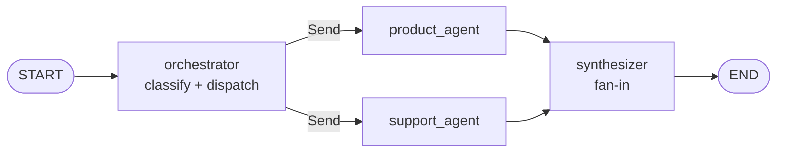
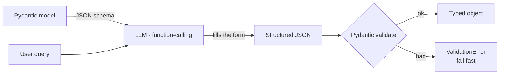
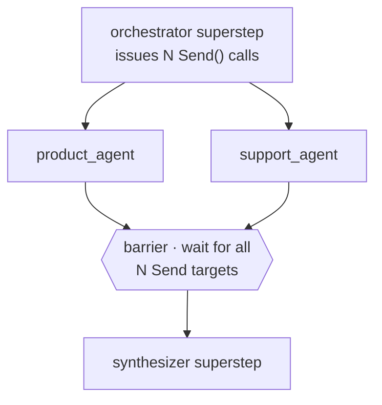
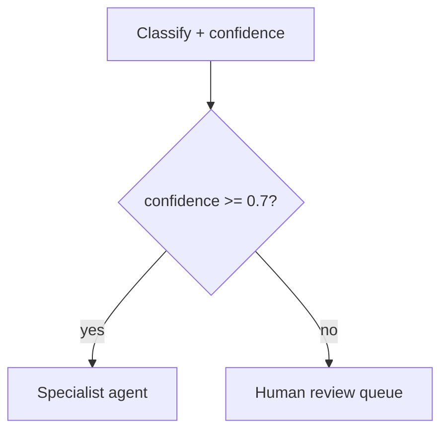

# Module 3 — The Orchestrator

> **Goal:** Add an LLM-powered orchestrator that classifies queries and dispatches to one or both agents in parallel.
> **Duration:** ~50 minutes
> **Builds on:** Module 2 (product + support subgraphs)
> **You will end with:** A fully working multi-agent graph — product queries, support queries, and mixed queries all handled end-to-end.

---

## What You'll Build

```
modules/stage3/
├── state.py   ← AxiomCartState, ClassificationResult (Pydantic), WorkerInput
├── nodes.py   ← orchestrator_node, product_agent, support_agent, synthesizer_node
└── graph.py   ← assemble and compile the full graph
```

Graph topology:

```
START -> orchestrator -+- product_agent --> synthesizer -> END
                       +- support_agent -^
```

As a graph, with the parallel fan-out and fan-in made explicit:



The orchestrator runs first. It uses an LLM to classify the query, then uses `Send()` to dispatch to one or both specialist agents. The agents run concurrently. The synthesizer waits for all results and produces the final answer.

---

## Concept 1: Structured LLM Output with Pydantic

### The problem with free-text classification

Ask an LLM "which agent should handle this query?" and it returns something like:

```
"This query is about products so I would route it to the product agent,
 and maybe also the support agent because there's an order mentioned."
```

Parsing this reliably is fragile — one changed word and your routing breaks. The structure of the response is undefined.

### `with_structured_output()` — forcing the LLM to fill a schema

```python
from pydantic import BaseModel, Field
from langchain.messages import AnyMessage

class AgentTask(BaseModel):
    agent: Literal["product_agent", "support_agent"]
    task_description: str = Field(description="What this agent should do")

class ClassificationResult(BaseModel):
    tasks: List[AgentTask]
    requires_synthesis: bool = Field(description="True if both agents ran and answers must be merged")
    reasoning: str

classifier = llm.with_structured_output(ClassificationResult)
result = classifier.invoke("Classify: My order ORD102 is late. Also show me alternatives.")

# result is now a fully typed Python object
print(result.tasks[0].agent)       # "support_agent"
print(result.requires_synthesis)   # True
print(result.reasoning)            # "Query contains both order status and product search..."
```

Under the hood, LangChain sends the Pydantic model's JSON schema to the OpenAI API via function calling mode. The LLM fills the schema like a form, and the API returns structured JSON. Pydantic validates and deserialises it into a typed Python object. If the LLM omits a required field or returns the wrong type, Pydantic raises a `ValidationError` immediately — you get a clear error instead of a silent downstream bug.



### Why `Field(description=...)` matters

The `description` you write in `Field(description=...)` is injected into the JSON schema that the LLM sees. It becomes documentation for the LLM about what to put in that field. Vague or missing descriptions lead to inconsistent outputs.

```python
# The LLM sees this as its "form instructions"
requires_synthesis: bool = Field(
    description="Set True only when BOTH product_agent and support_agent are needed "
                "and their answers must be combined into one response."
)
```

### Pydantic vs asking the LLM to output JSON

You could ask `"respond in JSON format"` — but the LLM often adds prose before/after the JSON block, uses single quotes instead of double quotes, or omits fields. `with_structured_output()` enforces schema compliance at the protocol level, not via prompt engineering.

References: [with_structured_output](https://python.langchain.com/docs/concepts/structured_outputs/) · [Pydantic models](https://docs.pydantic.dev/latest/concepts/models/)

---

## Concept 2: `Command` and `Send()` — Dynamic Parallel Dispatch

### Why static edges aren't enough

`add_conditional_edges()` routes to exactly one next node. But when the orchestrator decides both agents should run, we need to launch them simultaneously with different payloads. Static edges cannot do this — they have no mechanism to carry per-invocation data.

### `Send()` — a typed message to a node

```python
from langgraph.types import Send, Command

Send("product_agent", {"user_query": "...", "task_description": "Search for headphones"})
```

`Send(node_name, payload)` is an instruction to the Pregel runner: "send this payload as input to this node in the next superstep". The payload must conform to the target node's input type.

### `Command` — combine state update and routing in one return

```python
from langgraph.types import Command

def orchestrator_node(state: AxiomCartState) -> Command:
    result: ClassificationResult = classifier.invoke(state["user_query"])

    sends = []
    for task in result.tasks:
        payload = WorkerInput(
            user_query=state["user_query"],
            task_description=task.task_description,
            messages=state["messages"],
        )
        sends.append(Send(task.agent, payload))

    return Command(
        update={
            "tasks": result.tasks,
            "requires_synthesis": result.requires_synthesis,
            "agent_results": [],    # clear stale results from prior turns
        },
        goto=sends,                 # list of Send() objects — all run in parallel
    )
```

A `Command` bundles a state update and a routing decision into one return value. Without `Command`, a node could only return a state update dict — the routing would have to be specified as a static `add_conditional_edges()` rule. `Command` enables fully dynamic routing from inside a node function.

### How parallel execution works

When `goto` contains multiple `Send` objects, LangGraph's Pregel runner starts all of them in the same superstep. In Python (CPython), true parallelism is limited by the GIL for CPU-bound code — but LLM calls are I/O-bound (waiting for HTTP responses), so multiple agents can genuinely run concurrently via `asyncio` or by using `ainvoke`.

For synchronous `invoke()`, LangGraph still launches the sends as concurrent threads using a `ThreadPoolExecutor`. You get real concurrency for I/O-bound operations like LLM API calls.

### Fan-in: how `agent_results` accumulates safely

Each agent returns a `Command` that updates `agent_results`:

```python
# product_agent returns:
Command(update={"agent_results": [{"source": "product", "response": "..."}]}, goto="synthesizer")

# support_agent returns:
Command(update={"agent_results": [{"source": "support", "response": "..."}]}, goto="synthesizer")
```

`agent_results` is declared with `operator.add` as its reducer. LangGraph applies both updates independently, and the synthesizer receives the full list. The synthesizer does not run until all agents have written to it — LangGraph counts the expected writes based on the `Send()` calls and waits.

### `WorkerInput` — why agents don't receive the full parent state

```python
class WorkerInput(TypedDict):
    user_query: str
    task_description: str
    messages: list[AnyMessage]
```

Each agent receives a `WorkerInput` slice — not the full `AxiomCartState`. This keeps the agent's input schema narrow and prevents agents from accidentally reading or modifying orchestrator-level fields like `tasks`, `requires_synthesis`, or `agent_results`.

References: [Send() concepts](https://langchain-ai.github.io/langgraph/concepts/low_level/#send) · [Command](https://langchain-ai.github.io/langgraph/reference/types/#langgraph.types.Command) · [Multi-agent architectures](https://langchain-ai.github.io/langgraph/concepts/multi_agent/)

---

## Concept 3: The Synthesizer — Merging Concurrent Results

The synthesizer is the fan-in point. It runs after all agents have finished:

```python
def synthesizer_node(state: AxiomCartState) -> dict:
    results = state["agent_results"]

    if len(results) == 1:
        # Only one agent ran — pass through directly (no LLM call, no cost)
        return {"final_answer": results[0]["response"]}

    # Both agents ran — ask LLM to merge coherently
    parts = "\n\n".join(
        f"[{r['source'].upper()} AGENT]:\n{r['response']}"
        for r in results
    )
    merged = llm.invoke(
        f"You are a helpful assistant. Merge the following two responses into "
        f"one cohesive, friendly reply to the customer:\n\n{parts}"
    )
    return {"final_answer": merged.content}
```

Two separate responses would feel jarring: "Here are headphones. Your order is delayed." The LLM synthesizer weaves them into a natural unified reply.

**Why call the LLM only for the mixed case?** Single-agent cases are a simple pass-through — no extra LLM call, no extra latency or cost.

---

## Concept 4: Graph Assembly with `compile()`

`graph.py` wires everything together:

```python
builder = StateGraph(AxiomCartState)

builder.add_node("orchestrator",  orchestrator_node)
builder.add_node("product_agent", product_agent)
builder.add_node("support_agent", support_agent)
builder.add_node("synthesizer",   synthesizer_node)

builder.add_edge(START, "orchestrator")
builder.add_edge("synthesizer", END)

# NOTE: orchestrator -> agents edges are NOT added here.
# They are handled by Command(goto=Send(...)) inside orchestrator_node.
# product_agent -> synthesizer and support_agent -> synthesizer are
# handled by Command(goto="synthesizer") inside each agent function.
```

You do not call `add_edge` for the dynamic routes. The Pregel runner resolves them at execution time from the `Command` objects returned by nodes.

References: [StateGraph.compile()](https://langchain-ai.github.io/langgraph/reference/graphs/#langgraph.graph.state.StateGraph.compile)

---

## End-to-End Testing

Run the interactive demonstration from the **project root**:

```bash
uv run python modules/stage3/test_stage3.py
```

This demonstrates:
- Structured LLM output for four query types (product, support, mixed, greeting)
- Single agent vs parallel dispatch via `Send()`
- The full end-to-end graph for all three cases
- The graph topology

To run with pytest once you have assertion-based tests:

```bash
uv run pytest modules/stage3/ -v
```

---

## Design Tradeoffs

| Decision | We chose | Alternative | The trade-off |
|---|---|---|---|
| **Routing mechanism** | `Command(goto=Send(...))` (dynamic) | `add_conditional_edges()` (static) | Per-invocation payloads + parallel fan-out **vs.** simpler single-target routing. Static edges cannot carry a payload or launch two nodes at once. |
| **Classification** | `with_structured_output(Pydantic)` | "respond in JSON" prompt | Schema validated at the protocol level **vs.** fragile string parsing that breaks on one stray word. |
| **Fan-in** | `operator.add` reducer + reset to `[]` | A mutable shared list | Safe concurrent writes **vs.** race conditions and stale results bleeding across turns. |
| **Agent input** | Narrow `WorkerInput` slice | Full `AxiomCartState` | Isolation & easy unit tests **vs.** agents able to read or mutate orchestrator-only fields. |
| **Synthesis** | LLM call only when 2+ agents ran | Always synthesize | Zero extra cost/latency on single-agent turns **vs.** one uniform code path. |

> **The reset that prevents a real bug.** `orchestrator_node` returns `"agent_results": []`. Delete that line and Turn 1's product result lingers into Turn 2's support turn — the synthesizer then merges yesterday's answer with today's. The empty-list reset is the cheapest fix for cross-turn contamination, and a great thing to *break on purpose* once to see the failure.

> **Resilience.** Wrap each agent body in `try/except` and **always** return `Command(goto="synthesizer")` — even on failure, with an error entry in `agent_results`. Otherwise a crashed agent never signals the synthesizer, which waits forever on a write that never arrives. Likewise, catch `ValidationError` from `with_structured_output()` and fall back to `product_agent` as the safe default.

How LangGraph coordinates the parallel run — a **barrier** between supersteps is what lets the synthesizer trust that every agent has finished:



You never write this synchronisation yourself — the Pregel runner counts the `Send()` calls and releases the synthesizer only when all targets have written their results.

---

## Orchestration in the Real World: One Manager, Many Workers

The **orchestrator → specialists → synthesizer** shape is the canonical multi-agent topology. The same three pieces scale from two agents to a fleet.

### Example 1 — Adding a third specialist (a returns agent)

No new static edges — dynamic dispatch handles the wiring:

1. Write the node function that wraps `returns_subgraph.invoke()`.
2. Register it: `builder.add_node("returns_agent", returns_agent)`.
3. Add `"returns_agent"` to `AgentTask.agent`'s `Literal` type so the classifier can pick it.
4. Describe *when* to route there in the orchestrator's system prompt.

Because routing lives in `Command(goto=Send(...))`, the topology absorbs the new worker automatically. The orchestrator can even fan out to the **same** agent twice (`Send("product_agent", p1)`, `Send("product_agent", p2)`) to run two queries concurrently — both append via the reducer.

### Example 2 — Confidence-gated human review

Add a `confidence: float` to `AgentTask`. Below a threshold, route to a human queue instead of trusting the model — the safety valve every regulated workflow needs.



### Example 3 — Auditable routing for compliance

Add `orchestrator_reasoning: str` to the state and persist `classification.reasoning` next to each conversation. You now have a human-readable record of *why* every query was routed the way it was — invaluable for debugging and audits.

### Example 4 — Caching the classifier

The orchestrator makes an LLM call on every query. Cache the `ClassificationResult` in Redis keyed on a hash of the query; identical questions within a TTL window skip the call entirely — lower latency and a smaller bill. Pair it with `synthesis_style: Literal["bullet_points", "prose", "table"]` on `ClassificationResult` so the synthesizer can adapt its format per request.

---

## Production and Next Steps

- **LangGraph Platform (LangGraph Cloud):** Deploy the compiled graph as a managed service. You get REST endpoints for `invoke`, `stream`, and `thread` management without writing any server code. [LangGraph Platform docs](https://langchain-ai.github.io/langgraph/concepts/langgraph_platform/)
- **AsyncIO for true parallelism:** In production, replace `invoke` with `ainvoke` throughout. This lets the FastAPI event loop remain unblocked while agents wait for LLM API responses.
- **Structured logging per agent:** Log `orchestrator_reasoning`, `tasks`, and per-agent latency with a correlation ID. In a microservices environment you need to trace which agent produced which result for which request.
- **Rate limiting the orchestrator:** The orchestrator makes an LLM call for every user query. Add a cache (Redis) keyed on query hash — identical queries within a TTL window reuse the previous classification result.

Next step: [Module 4](../stage4/README.md) — add conversation memory with `MemorySaver` and HITL pause/resume with `interrupt()`.
