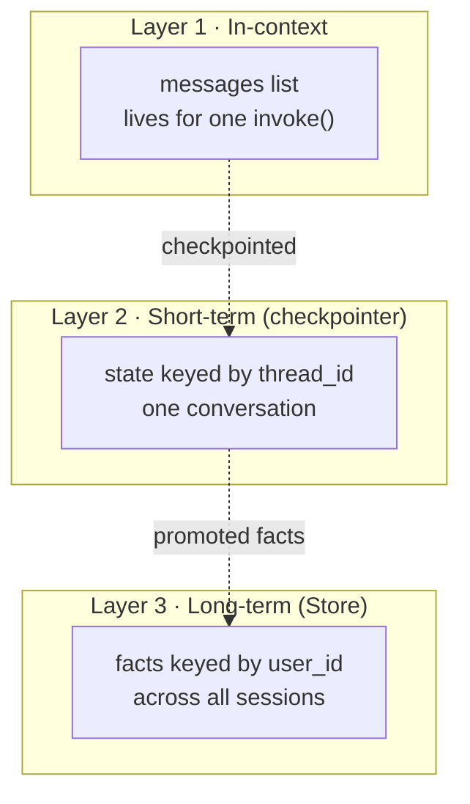
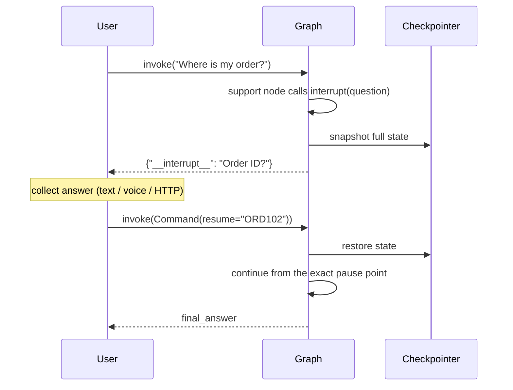
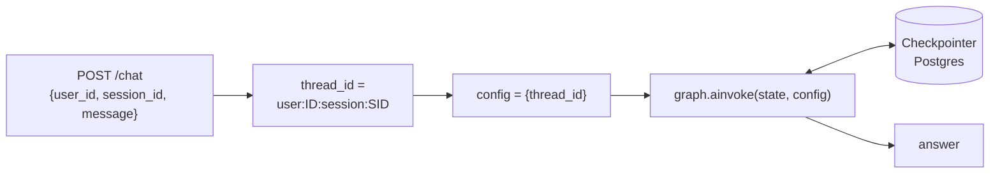

# Module 4 — Complete AxiomCart

> **Goal:** Add conversation memory, human-in-the-loop pause/resume, a REPL, and optional voice I/O — completing the full production system.
> **Duration:** ~35 minutes
> **Builds on:** Module 3 (full multi-agent graph)
> **You will end with:** The final AxiomCart AI assistant — multi-turn, interruptible, optionally voice-enabled.

---

## What You'll Build

```
modules/stage4/
├── nodes.py   ← support_subgraph_hitl (interrupt-enabled support agent)
├── graph.py   ← Module 3 graph + MemorySaver checkpointer
└── main.py    ← AxiomCartAssistant class + text_loop + voice_loop + CLI
```

---

## Concept 1: Memory in LangGraph

LangGraph has three distinct memory layers. Understanding which one applies to a given problem is essential for production systems.

### Layer 1 — In-context memory (ephemeral)

The `messages` list in state is in-context memory. It exists only during the current `invoke()` call. Once the call returns, this memory is gone unless you persist it externally.

```python
# Stateless: each invoke() is independent
graph.invoke({"messages": [HumanMessage("show me headphones")]})
graph.invoke({"messages": [HumanMessage("what about sony?")]})
# The second call has no idea what "that" refers to
```

### Layer 2 — Short-term memory via checkpointing (thread-scoped)

A checkpointer serialises the full graph state after every node execution and stores it keyed by `thread_id`. On the next `invoke()` with the same `thread_id`, the state is restored first — the graph appears to continue from where it left off.

```python
from langgraph.checkpoint.memory import MemorySaver

memory = MemorySaver()
graph = builder.compile(checkpointer=memory)

config = {"configurable": {"thread_id": "session-abc"}}

# Turn 1
graph.invoke({"messages": [HumanMessage("show me headphones")], ...}, config)

# Turn 2 — state is restored; agent sees Turn 1's messages
graph.invoke({"messages": [HumanMessage("what about sony?")], ...}, config)

# Different session — completely isolated
graph.invoke({"messages": [HumanMessage("hello")]},
             {"configurable": {"thread_id": "session-xyz"}})
```

One `thread_id` = one conversation session. Different `thread_id` = independent sessions.

### Layer 3 — Long-term memory via the Store API (user-scoped, cross-thread)

The LangGraph `Store` API persists facts across multiple `thread_id`s — across separate sessions of the same user. Use this for user preferences, saved addresses, or purchase history.

```python
from langgraph.store.memory import InMemoryStore

store = InMemoryStore()
graph = builder.compile(checkpointer=memory, store=store)

# Inside a node:
def profile_node(state, *, store):
    items = store.search(("user_profiles", state["user_id"]))
    store.put(("user_profiles", state["user_id"]), "preference", {"brand": "Sony"})
```

In production, use `AsyncPostgresStore` or `AsyncRedisStore` so data survives process restarts.
The three layers, and how facts flow upward from one to the next:


### Checkpointer backends

| Backend | When to use |
|---|---|
| `MemorySaver` | Development and testing only — data lost on process restart |
| `PostgresSaver` | Production with PostgreSQL — survives restarts, scales horizontally |
| `RedisSaver` | Production with Redis — sub-millisecond reads, high throughput |
| `SqliteSaver` | Local dev with persistence — single file, not for multi-process |

Migrating from `MemorySaver` to `PostgresSaver` is a one-line change — graph and node code are identical:

```python
# Development
graph = builder.compile(checkpointer=MemorySaver())

# Production
from langgraph.checkpoint.postgres import PostgresSaver
with PostgresSaver.from_conn_string(os.environ["DATABASE_URL"]) as saver:
    saver.setup()   # creates checkpoint tables if they don't exist
    graph = builder.compile(checkpointer=saver)
```

### `thread_id` in a web application

```python
@app.post("/chat")
async def chat(request: ChatRequest, user_id: str = Depends(get_current_user)):
    # Compose thread_id server-side — never take it directly from user input
    thread_id = f"user:{user_id}:session:{request.session_id}"
    config = {"configurable": {"thread_id": thread_id}}
    result = await graph.ainvoke(
        {"messages": [HumanMessage(request.message)], ...}, config
    )
    return {"answer": result["final_answer"]}
```

References: [MemorySaver](https://langchain-ai.github.io/langgraph/reference/checkpoints/#langgraph.checkpoint.memory.MemorySaver) · [Persistence concepts](https://langchain-ai.github.io/langgraph/concepts/persistence/) · [Memory concepts](https://langchain-ai.github.io/langgraph/concepts/memory/) · [Store API](https://langchain-ai.github.io/langgraph/reference/store/)

---

## Concept 2: Human-in-the-Loop with `interrupt()`

### The problem

A customer types "Where is my order?" The support agent needs an order ID to call `get_order_status()`. Without HITL, the agent asks in its reply — but the next `invoke()` re-classifies from scratch, re-routes through the orchestrator, and all mid-execution context is lost.

### How `interrupt()` solves this

`interrupt()` literally pauses the entire graph at the exact line it is called. The full state is written to the checkpointer. The calling code receives `{"__interrupt__": [...]}`. When the user answers, `Command(resume=answer)` restores the state and continues from exactly where it paused — no re-classification, no re-routing.

```python
from langgraph.types import interrupt

def support_model_node_hitl(state: AgentState) -> dict:
    response = support_llm.invoke(state["messages"])

    if not response.tool_calls:
        any_tools_called = any(isinstance(m, ToolMessage) for m in state["messages"])
        if not any_tools_called:
            # PAUSE here. Argument is the question for the user.
            user_reply = interrupt(response.content)
            # Execution resumes HERE when Command(resume=...) is called.
            return {"messages": [response, HumanMessage(content=str(user_reply))]}

    return {"messages": [response]}
```

### The full pause/resume protocol

```python
config = {"configurable": {"thread_id": "session-xyz"}}

# Step 1: graph pauses mid-execution
result = graph.invoke(
    {"messages": [HumanMessage("Where is my order?")], "user_query": "..."},
    config,
)
question = result["__interrupt__"][0].value
# "Could you please provide your order ID?"

# Step 2: collect the user's answer (input(), HTTP body, voice reply, etc.)

# Step 3: resume from the exact pause point — SAME thread_id
result = graph.invoke(Command(resume="ORD102"), config)
print(result["final_answer"])
```

The whole pause/resume handshake across two `invoke()` calls:



### Why `interrupt()` beats alternatives

| Approach | Problem |
|---|---|
| Multi-turn via new message | Orchestrator re-classifies, context lost |
| Callback functions | Breaks async execution, untestable |
| `interrupt()` | First-class primitive, state fully preserved, pytest-testable |

### Subgraph checkpointer inheritance

The HITL subgraph compiles **without** a checkpointer:

```python
support_subgraph_hitl = _sb_hitl.compile()
# NOT: _sb_hitl.compile(checkpointer=MemorySaver())
```

The parent graph supplies the `MemorySaver`. When a subgraph is added as a node to a parent with a checkpointer, it inherits the parent's checkpointing context automatically. Giving the subgraph its own checkpointer creates a redundant nested namespace — duplicated storage, unreliable restoration.

**Rule:** Only the root graph has a checkpointer. Subgraphs registered via `add_node(subgraph)` inherit it. Subgraphs called via `.invoke()` inside a function do not inherit it (their state is captured through the parent node's return value).

References: [interrupt()](https://langchain-ai.github.io/langgraph/reference/types/#langgraph.types.interrupt) · [Command](https://langchain-ai.github.io/langgraph/reference/types/#langgraph.types.Command) · [HITL concepts](https://langchain-ai.github.io/langgraph/concepts/human_in_the_loop/)

---

## Concept 3: Voice I/O — Same Graph, Different Interface

```
Text mode:   input()      -->  graph.invoke()  -->  print()
Voice mode:  Whisper STT  -->  graph.invoke()  -->  OpenAI TTS  -->  speakers
                                     ^
                           exact same compiled graph, unchanged
```

The graph is agnostic about I/O. Adding a third interface (Slack bot, REST API, WhatsApp connector) requires no graph changes — only a new input/output wrapper.

---

## Environment Setup

If you haven't set up from Module 1:

**macOS / Linux**

```bash
# Install uv (one-time)
curl -LsSf https://astral.sh/uv/install.sh | sh

# Create virtualenv and install all dependencies
uv venv .venv --python 3.11
source .venv/bin/activate
uv sync

# Configure secrets
cp .env.example .env
# Edit .env: OPENAI_API_KEY=sk-...
```

**Windows (PowerShell)**

```powershell
# Install uv (one-time) — then reopen the terminal so `uv` is on PATH
powershell -ExecutionPolicy ByPass -c "irm https://astral.sh/uv/install.ps1 | iex"

# Create virtualenv and install all dependencies
uv venv .venv --python 3.11
.venv\Scripts\Activate.ps1
uv sync

# Configure secrets
copy .env.example .env
# Edit .env: OPENAI_API_KEY=sk-...
```

---

## End-to-End Testing

Run the interactive demonstration from the **project root**:

```bash
uv run python modules/stage4/test_stage4.py
```

This demonstrates multi-turn memory, HITL pause/resume, and the full session.

Run all modules' tests together:

```bash
uv run pytest modules/ -v
```

For HITL with pytest — two `graph.invoke()` calls, no interactive loop needed:

```python
# modules/stage4/test_hitl.py
from langchain.messages import HumanMessage
from langgraph.types import Command
from modules.stage4.graph import axiomcart_graph

def test_hitl_pause_and_resume():
    config = {"configurable": {"thread_id": "test-hitl-1"}}

    # Step 1: trigger the interrupt
    result = axiomcart_graph.invoke(
        {"messages": [HumanMessage("Where is my order?")], "user_query": "Where is my order?"},
        config,
    )
    assert "__interrupt__" in result
    assert "order" in result["__interrupt__"][0].value.lower()

    # Step 2: resume with the answer
    result2 = axiomcart_graph.invoke(Command(resume="ORD102"), config)
    assert result2.get("final_answer")
```

Run it:

```bash
uv run pytest modules/stage4/test_hitl.py -v
```

---

## Design Tradeoffs

| Decision | We chose | Alternative | The trade-off |
|---|---|---|---|
| **Checkpointer** | `MemorySaver` (in-memory dict) | `PostgresSaver` / `RedisSaver` / `SqliteSaver` | Zero setup for the course **vs.** durability across restarts and horizontal scale. Migrating is a one-line change at `compile()`. |
| **Mid-execution input** | `interrupt()` | A new message through the orchestrator | State fully preserved, no re-classification, pytest-testable **vs.** a simpler conversational follow-up. Reach for `interrupt()` only when the graph *cannot proceed* without input. |
| **Subgraph checkpointer** | None — inherits the parent's | Its own `MemorySaver` | Single source of truth **vs.** a redundant nested namespace with duplicated storage and unreliable restoration. |
| **`thread_id` source** | Composed server-side | Taken from client input | Prevents session hijacking **vs.** convenience. Never trust a client-supplied thread key. |
| **Voice** | An I/O wrapper around the same graph | A separate voice graph | One graph, many front-ends **vs.** duplicated logic. |

> **Choosing a memory layer.** Checkpointing answers "remember this *session*"; the Store answers "remember this *user* across all sessions". A stranded `interrupt()` (the user never replies) simply leaves a checkpoint behind — add a sweeper job that resumes with a default value or deletes checkpoints older than N minutes.

In a web app, the `thread_id` is the hinge the whole memory system turns on — and it must be assembled on the server:



---

## Production Patterns: Memory, Approval, and Voice in the Real World

Memory + HITL + an I/O wrapper is what turns a demo into a product. The same primitives below power very different systems.

### Example 1 — Multi-step approval workflows

Before `escalate_to_human()` files a ticket, `interrupt()` shows the draft to a supervisor and resumes only on approval. Chain several `interrupt()` calls for multi-stage sign-off — each is one pause point, resumed in order.

### Example 2 — Persistent user profiles (Store)

Write detected preferences (favourite brand, budget range) to the Store on every turn, then inject them into the system prompt at the start of the *next* session — so a returning user is greeted by an assistant that already knows their tastes.

### Example 3 — Human handoff with full context

When escalation fires, export `messages` from the checkpoint and hand the entire transcript to a live agent — zero context loss, no "can you repeat your issue?".

### Example 4 — Multi-modal HITL

In voice mode the interrupt question is spoken via TTS and the reply transcribed by Whisper; `Command(resume=transcribed_text)` resumes the identical graph. The pause/resume primitive does not care whether the answer arrives as text, speech, or an HTTP body — which is exactly why the same graph serves every front-end.

---

## Production Deployment and Next Steps

### Option 1 — LangGraph Platform (recommended)

Deploy the compiled graph as a managed service with built-in `PostgresSaver`, REST endpoints for invoke/stream/interrupt-resume, and LangSmith integration.

```bash
# Install the CLI inside your uv environment
uv add langgraph-cli --dev

# Local Docker deployment
uv run langgraph up

# LangGraph Cloud
uv run langgraph deploy
```

References: [LangGraph Platform quickstart](https://langchain-ai.github.io/langgraph/concepts/langgraph_platform/) · [LangGraph CLI](https://langchain-ai.github.io/langgraph/cloud/reference/cli/)

### Option 2 — Self-hosted FastAPI

```python
from fastapi import FastAPI
from contextlib import asynccontextmanager
from langgraph.checkpoint.postgres.aio import AsyncPostgresSaver

@asynccontextmanager
async def lifespan(app: FastAPI):
    async with AsyncPostgresSaver.from_conn_string(os.environ["DATABASE_URL"]) as saver:
        await saver.setup()
        app.state.graph = build_graph(checkpointer=saver)
        yield

app = FastAPI(lifespan=lifespan)

@app.post("/chat")
async def chat(body: ChatRequest):
    config = {"configurable": {"thread_id": body.thread_id}}
    result = await app.state.graph.ainvoke(
        {"messages": [HumanMessage(body.message)], "user_query": body.message}, config
    )
    return {"answer": result["final_answer"]}

@app.post("/chat/resume")
async def resume(body: ResumeRequest):
    config = {"configurable": {"thread_id": body.thread_id}}
    result = await app.state.graph.ainvoke(Command(resume=body.answer), config)
    return {"answer": result["final_answer"]}
```

Production requirements:
- Use `AsyncPostgresSaver` — never the sync version in an async server
- Compose `thread_id` server-side to prevent session-hijacking
- Add rate limiting (slowapi) on `/chat` to control LLM costs
- Stream via SSE using `graph.astream()` for better perceived latency

### Observability checklist

| What | Tool |
|---|---|
| LLM traces | LangSmith (`LANGCHAIN_TRACING_V2=true`, `LANGCHAIN_API_KEY`) |
| Application metrics | Prometheus + Grafana (p50/p99 latency, error rate) |
| Structured logs | structlog + Datadog/Loki (correlate with `thread_id`) |
| Checkpoint storage | PostgreSQL metrics (row count, query latency) |
| Cost alerts | OpenAI usage dashboard (daily token spend) |

### Further reading

- [LangGraph how-to guides](https://langchain-ai.github.io/langgraph/how-tos/) — step-by-step recipes for every major pattern
- [LangGraph conceptual docs](https://langchain-ai.github.io/langgraph/concepts/) — state, checkpointing, subgraphs, memory in depth
- [LangGraph Platform docs](https://langchain-ai.github.io/langgraph/concepts/langgraph_platform/) — deployment and scaling
- [LangSmith](https://docs.smith.langchain.com/) — tracing and evaluation
- [FastAPI deployment](https://fastapi.tiangolo.com/deployment/) — serving the graph as an API
- [OpenAI function calling](https://platform.openai.com/docs/guides/function-calling) — the protocol underlying all tool calls
